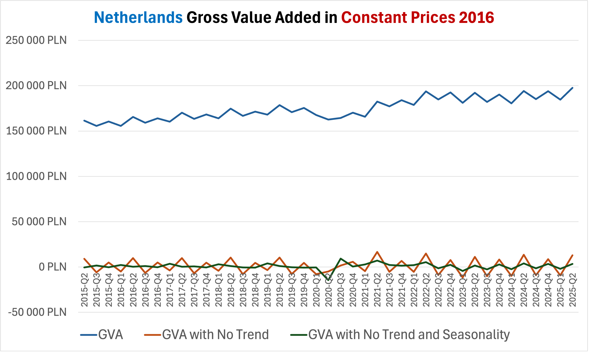
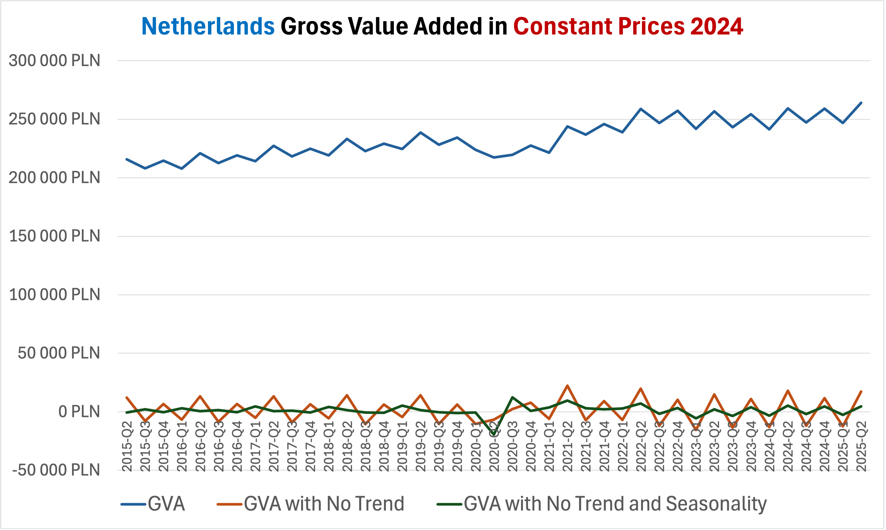
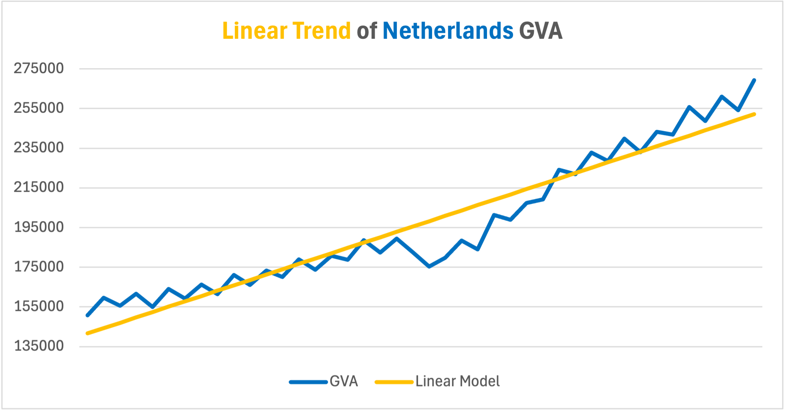
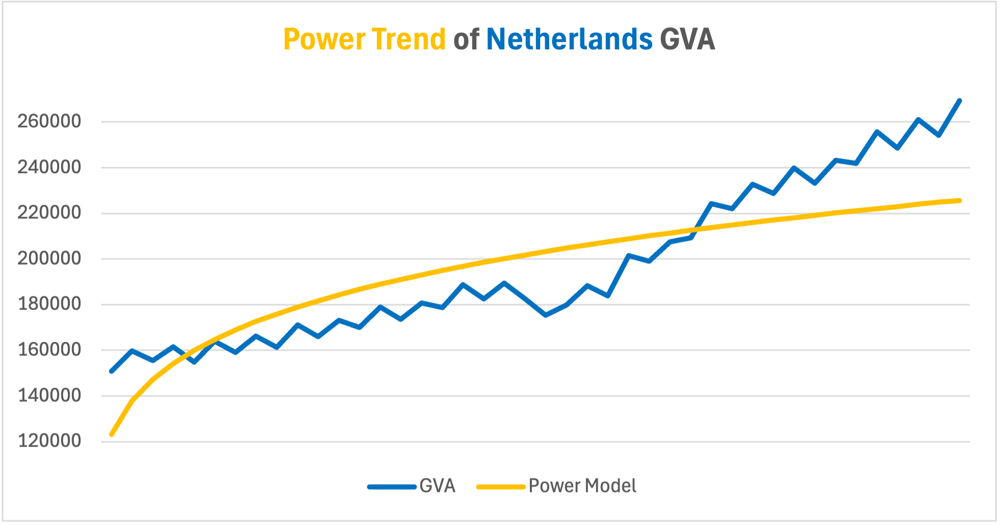
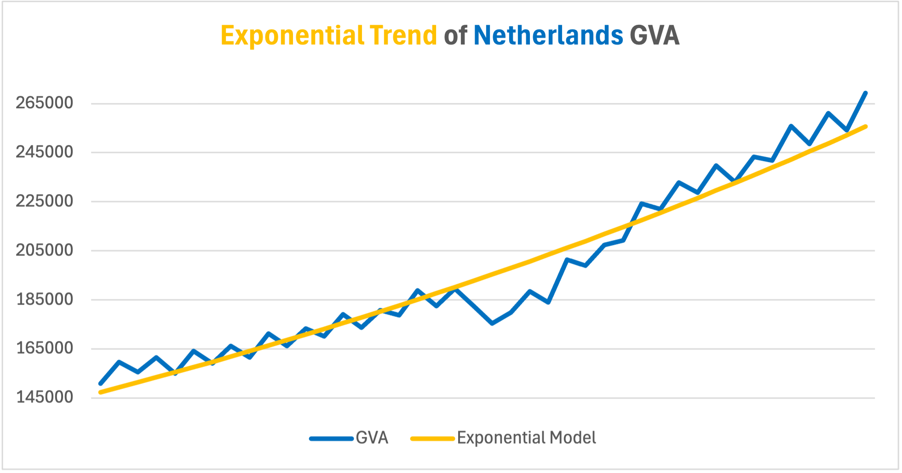
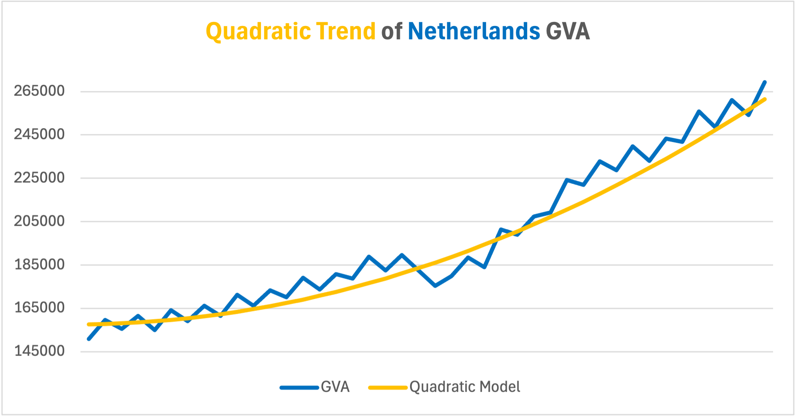
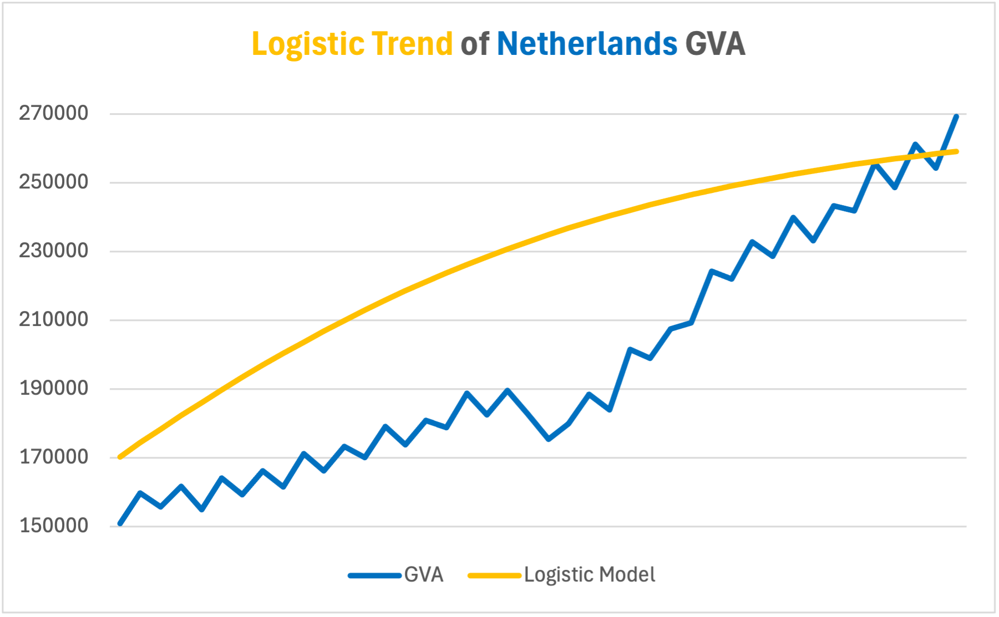

# 🇳🇱 Netherlands Gross Value Added (GVA): Time Series Analysis

Niniejsze repozytorium zawiera projekt zaliczeniowy z przedmiotu **Analiza Szeregów Czasowych**, którego celem jest analiza szeregu czasowego przedstawiającego **wartość dodaną brutto (Gross Value Added, GVA) w Holandii** w okresie **2015Q1–2025Q2** oraz budowa modeli mogących znaleźć zastosowanie w **prognozowaniu**.

Projekt obejmuje pełen proces analizy szeregów czasowych — od wstępnego przetwarzania danych, przez modelowanie ekonometryczne, aż po interpretację wyników.

Wykorzystane narzędzia: Excel, Gretl

### Zakres projektu

W ramach projektu zrealizowano następujące etapy analizy:

- dekompozycja szeregu czasowego (usuwanie trendu i sezonowości),
- deflacja danych – konwersja cen nominalnych do cen stałych,
- estymacja modeli przy użyciu **klasycznej metody najmniejszych kwadratów (KMNK)**,
- identyfikacja i analiza **załamania strukturalnego** spowodowanego pandemią COVID-19,
- analiza autokorelacji i własności składnika losowego,
- zastosowanie **zmiennych sztucznych (dummy variables)**,
- budowa i analiza **modeli autoregresyjnych (AR)**.

Projekt ma charakter analityczno-modelowy i stanowi spójną podstawę do dalszych prac prognostycznych oraz rozbudowy o bardziej zaawansowane modele.

# Raport

*W tej sekcji przedstawiono kluczowe etapy analizy oraz najważniejsze wnioski.  
W celu zapoznania się z pełnym projektem oraz kompletną dokumentacją obliczeń i modeli, zapraszam do przejrzenia pliku Excel znajdującego się w folderze* `src`*.*

### Opis szeregu

Wartość dodana brutto (GVA – *Gross Value Added*) jest miarą określającą, ile realnej wartości ekonomicznej zostało wytworzone w gospodarce przez przedsiębiorstwa, sektory gospodarki lub całe państwo w danym okresie.

Analizowany szereg czasowy opisany jest przez następujące zmienne:

- $t$ — zmienna reprezentująca czas,  
- $GVA_t$ — wartość dodana brutto w okresie $t$.

### Dekompozycja szeregu czasowego

Do usunięcia trendu zastosowano **różnicowanie pierwszego rzędu** (*first-order differencing*):

$$
GVA_{\text{noTrend}} = GVA_{t} - GVA_{t-1}
$$

Sezonowość usunięto metodą **addytywnej dekompozycji sezonowej z wykorzystaniem wskaźników sezonowych**:

$$
GVA_{\text{noTrendNoSeasonality}} = GVA_{\text{noTrend}} - \text{cleanedIndicator}(q),
$$

gdzie $\text{cleanedIndicator}(q)$ to **oczyszczony wskaźnik sezonowy** przypisany do kwartału $q$, wyznaczony na podstawie komponentu sezonowego szeregu po usunięciu trendu, reprezentujący systematyczne, powtarzalne odchylenia sezonowe niezależne od trendu długookresowego.

*Wykres przedstatawia zmiany, jakie dokonano dzięki dekompozycji trendu i sezonowości*

### Deflacja danych

Ze względu na występowanie inflacji, poziomy cen sprzed kilku–kilkunastu lat są zaniżone względem cen bieżących, co utrudnia bezpośrednią porównywalność obserwacji w czasie.  
Dlatego zdecydowano się przeanalizować szereg w **cenach stałych**, przyjmując jako lata bazowe **2016** oraz **2024**.

W tym celu pozyskano oficjalne roczne wartości GVA, a następnie — przy użyciu narzędzia **Solver** — oszacowano wartość $GVA_{2016Q1}$ poprzez minimalizację funkcji:

$$
\text{abs}(\sum_{t=2016Q1}^{2016Q4}{[GVA_t]} - GVA_{2016})
$$

co zapewnia zgodność sumy kwartalnych obserwacji z oficjalną wartością roczną dla 2016 roku.

Analogicznie proces wykonano dla obliczenia cen stałych z 2024 roku.

  
  

*Wykresy przedstawiają zdekomponowane szeregi w cenach z 2016 i 2024 roku*

Dzięki temu wyeliminowano wpływ inflacji, co pozwala na analizę i prognozowanie wartości realnej w cenach stałych, odpowiadających poziomowi dzisiejszemu.

### Modele regresji

W celu oszacowania modelu, który najlepiej opisje szereg wykorzystano klasyczną metodę najmniejszych kwadratów. Dodatkowo przeprowadzono testy istotności parametrów aby móc wykorzystać istotne statystycznie współczynniki. Efektem działań są następujące modele.

| Nazwa modelu      | Wzór modelu                              | $\beta_0$   | $\beta_1$  | $\beta_2$ |
|------------------|-----------------------------------------|------------|------------|-----------|
| Linear            | $\hat{y}_t = \beta_0 + \beta_1 t$       | 138918.19  | 2695.59    |           |
| Power             | $\hat{y}_t = e^{\beta_0} t^{\beta_1}$  | 11.72      | 0.16       |           |
| Exponential       | $\hat{y}_t = e^{\beta_0 + \beta_1 t}$  | 11.89      | 0.01       |           |
| Quadratic         | $\hat{y}_t = \beta_0 + \beta_2 t^2$    | 157513.54  |            | 58.97     |
| Logistic          | $\hat{y}_t = \frac{\beta_0}{1+\beta_1 e^{\beta_2 t}}$ | 269320     | 0.62      | 0.07      |

  
  
  

  
  

*Wykresy przedstawiają wizualnie oszacowane modele regresji*

W każdym modelu oszacowano również średnią szybkość i tempo zmian:

$$
    \text{speed}=\frac{\partial\hat{y}}{\partial t}, \quad \text{velocity}=\frac{1}{\hat{y}}\times \frac{\partial\hat{y}}{\partial t}
$$

Na podstawie analizy wariancji reszt dla różnych modeli zdecydowano się na wybór **modelu kwadratowego**, który charakteryzuje się najniższą wariancją reszt, co świadczy o najlepszym dopasowaniu do danych.

| Model                  | Wariancja reszt       | Wariancja [%] |
|------------------------|---------------------|---------------|
| Linear                 | 1,80575E+16          | 499,71%       |
| Power                  | 1,59969E+17          | 4426,86%      |
| Exponential            | 1,00026E+16          | 276,80%       |
| **Quadratic**              | **3,6136E+15**           | **100,00%**       |
| Logistic               | 9,01535E+17          | 24948,35%     |

**Wniosek:** Model kwadratowy najlepiej opisuje analizowany szereg czasowy, a jego reszty mają najniższą wariancję, co oznacza minimalizację błędu dopasowania.

### Załamanie strukturalne wywołane pandemią COVID-19

W 2020 roku, w wyniku pandemii COVID-19, gospodarka Holandii doświadczyła gwałtownego załamania, co znalazło odzwierciedlenie w wyraźnie obniżonych wartościach GVA.  
Aby uwzględnić ten **nietypowy, jednorazowy efekt** w modelu szeregów czasowych, wprowadzono **zmienną sztuczną (dummy variable)** przyjmującą wartość 1 od czasu pandemii, a 0 w pozostałych kwartałach.

Po analizie istotności statystycznej współczynników modelu uzyskano następujący wynik.

$$
\hat{y} = \beta_0 + \beta_1t + \gamma_0 d + \gamma_1dt, \quad  d = 1 \text{ if } t \geq 2020Q1 \text{ else } 0
$$
