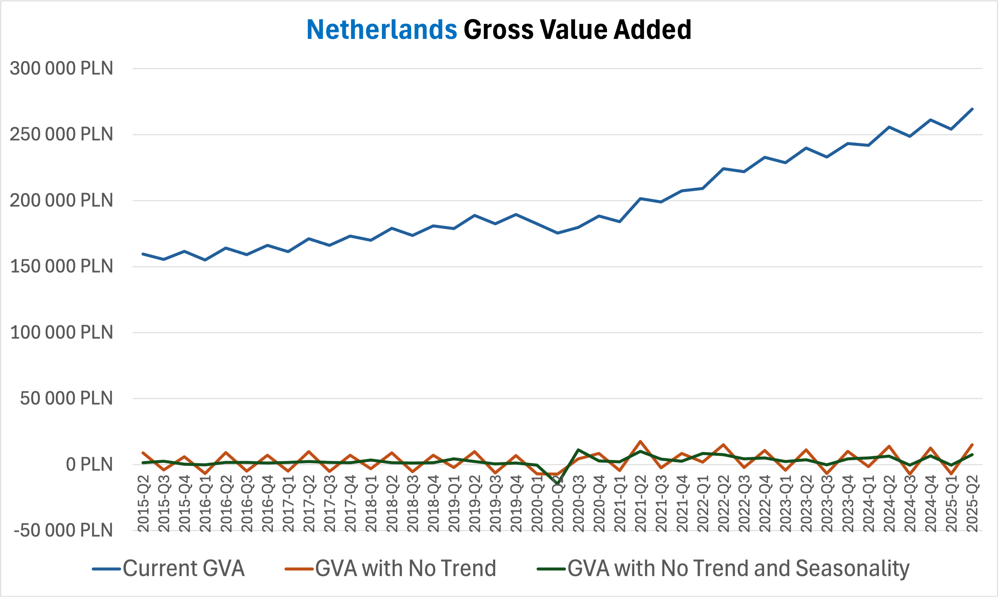

# 🇳🇱 Netherlands Gross Value Added (GVA): Time Series Analysis

Niniejsze repozytorium zawiera projekt zaliczeniowy z przedmiotu **Analiza Szeregów Czasowych**, którego celem jest analiza szeregu czasowego przedstawiającego **wartość dodaną brutto (Gross Value Added, GVA) w Holandii** w okresie **2015Q1–2025Q2** oraz budowa modeli mogących znaleźć zastosowanie w **prognozowaniu**.

Projekt obejmuje pełen proces analizy szeregów czasowych — od wstępnego przetwarzania danych, przez modelowanie ekonometryczne, aż po interpretację wyników.

Wykorzystane narzędzia: Excel, Gretl

### Zakres projektu

W ramach projektu zrealizowano następujące etapy analizy:

- dekompozycja szeregu czasowego (usuwanie trendu i sezonowości),
- deflacja danych – konwersja cen nominalnych do cen stałych,
- estymacja modeli przy użyciu **klasycznej metody najmniejszych kwadratów (KMNK)**,
- identyfikacja i analiza **załamania strukturalnego** spowodowanego pandemią COVID-19,
- analiza autokorelacji i własności składnika losowego,
- zastosowanie **zmiennych sztucznych (dummy variables)**,
- budowa i analiza **modeli autoregresyjnych (AR)**.

Projekt ma charakter analityczno-modelowy i stanowi spójną podstawę do dalszych prac prognostycznych oraz rozbudowy o bardziej zaawansowane modele.

# Raport

*W tej sekcji przedstawiono kluczowe etapy analizy oraz najważniejsze wnioski.  
W celu zapoznania się z pełnym projektem oraz kompletną dokumentacją obliczeń i modeli, zapraszam do przejrzenia pliku Excel znajdującego się w folderze* `src`*.*

### Opis szeregu

Wartość dodana brutto (GVA – *Gross Value Added*) jest miarą określającą, ile realnej wartości ekonomicznej zostało wytworzone w gospodarce przez przedsiębiorstwa, sektory gospodarki lub całe państwo w danym okresie.

Analizowany szereg czasowy opisany jest przez następujące zmienne:

- $t$ — zmienna reprezentująca czas,  
- $GVA_t$ — wartość dodana brutto w okresie $t$.

### Dekompozycja szeregu czasowego

Do usunięcia trendu zastosowano **różnicowanie pierwszego rzędu** (*first-order differencing*):

$$
GVA_{\text{noTrend}} = GVA_{t} - GVA_{t-1}
$$

Sezonowość usunięto metodą **addytywnej dekompozycji sezonowej z wykorzystaniem wskaźników sezonowych**:

$$
GVA_{\text{noTrendNoSeasonality}} = GVA_{\text{noTrend}} - \text{cleanedIndicator}(q),
$$

gdzie $\text{cleanedIndicator}(q)$ to **oczyszczony wskaźnik sezonowy** przypisany do kwartału $q$, wyznaczony na podstawie komponentu sezonowego szeregu po usunięciu trendu, reprezentujący systematyczne, powtarzalne odchylenia sezonowe niezależne od trendu długookresowego.

*Wykres przedsatawia zmiany, jakie dokonano dzięki dekompozycji trendu i sezonowości*

### Deflacja danych

Ze względu na występowanie inflacji, poziomy cen sprzed kilku–kilkunastu lat są zaniżone względem cen bieżących, co utrudnia bezpośrednią porównywalność obserwacji w czasie.  
Dlatego zdecydowano się przeanalizować szereg w **cenach stałych**, przyjmując jako lata bazowe **2016** oraz **2024**.

W tym celu pozyskano oficjalne roczne wartości GVA, a następnie — przy użyciu narzędzia **Solver** — oszacowano wartość $GVA_{2016Q1}$ poprzez minimalizację funkcji:

$$
\Bigg|\sum_{t=2016Q1}^{2016Q4}{[GVA_t]} - GVA_{2016}\Bigg|
$$

co zapewnia zgodność sumy kwartalnych obserwacji z oficjalną wartością roczną dla 2016 roku.

Analogicznie proces wykonano dla obliczenia cen stałych z 2024 roku.