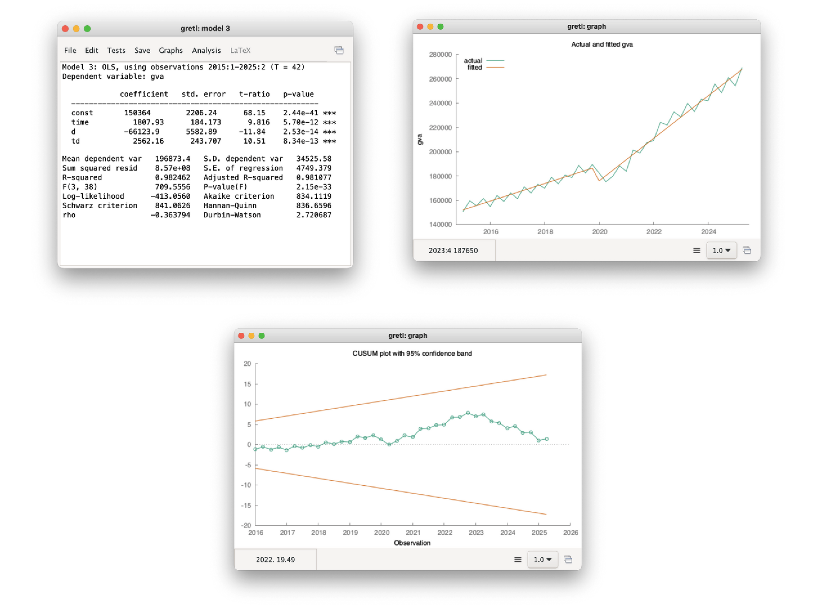
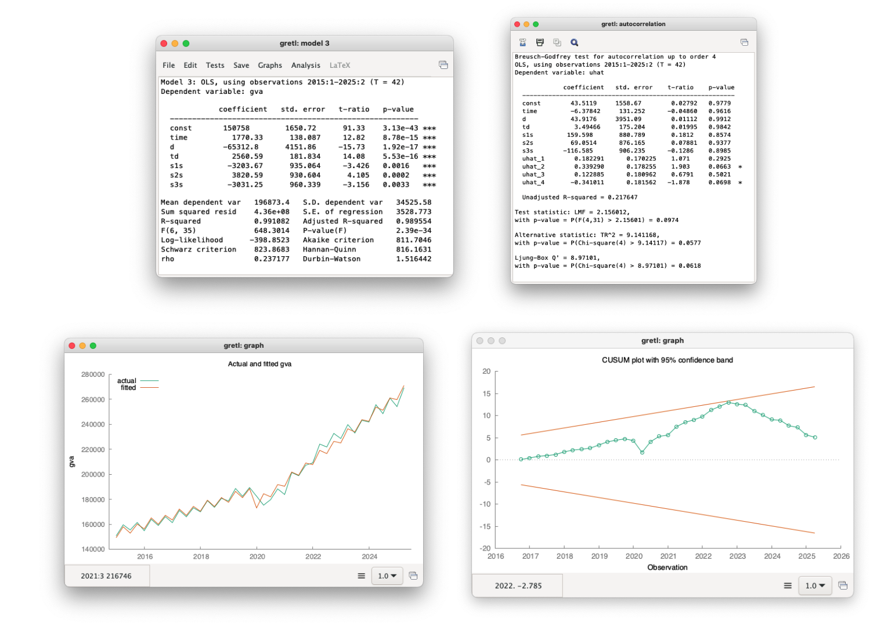
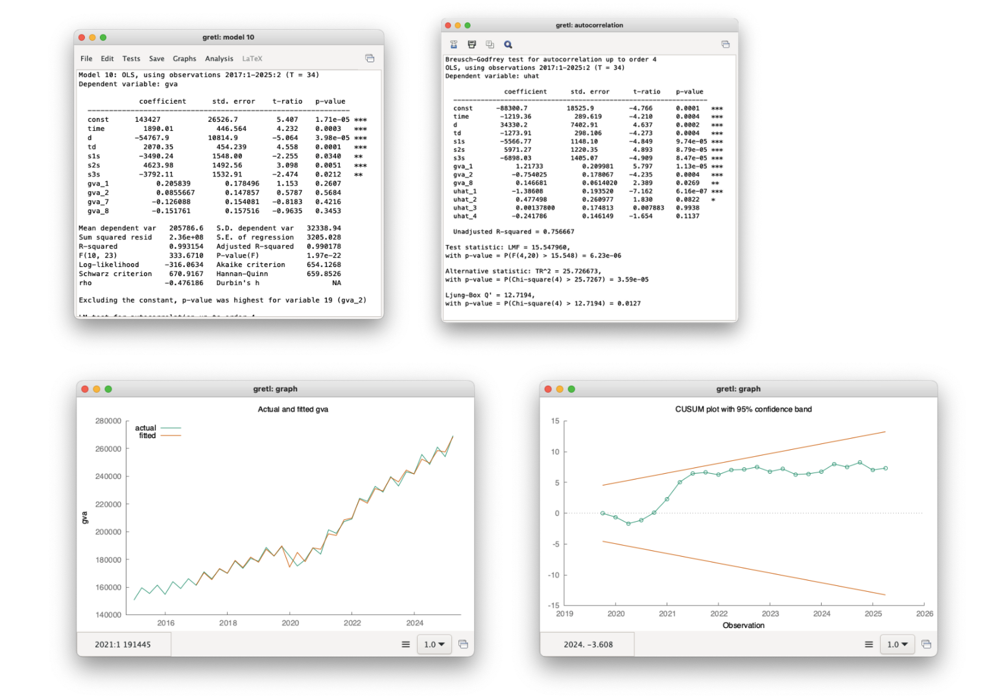

# 🇳🇱 Netherlands Gross Value Added (GVA): Time Series Analysis

This repository contains a course project for **Time Series Analysis**, aimed at analyzing the time series of **Gross Value Added (GVA) in the Netherlands** for the period **2015Q1–2025Q2**, as well as building models that can be used for **forecasting**.

The project covers the entire time series analysis process — from initial data preprocessing, through econometric modeling, to the interpretation of results.

**Tools used**: *Excel*, *Gretl*

### Project Scope

The project involved the following stages of analysis:

- Time series decomposition (removing trend and seasonality),
- Data deflation – converting nominal prices to constant prices,
- Model estimation using the **classical Ordinary Least Squares (OLS) method**,
- Identification and analysis of **structural breaks** caused by the COVID-19 pandemic,
- Analysis of autocorrelation and properties of the stochastic component,
- Use of **dummy variables**,
- Construction and analysis of **autoregressive (AR) models**.

The project is analytical and modeling in nature, providing a coherent foundation for further forecasting work and expansion with more advanced models.

# Report

*This section presents the key stages of the analysis and the main conclusions.  
For a full overview of the project and complete documentation of calculations and models, please refer to the Excel file located in the* `src` *folder.*

### Time Series Description

Gross Value Added (GVA) is a measure that indicates how much real economic value has been created in the economy by enterprises, economic sectors, or the entire country during a given period.

The analyzed time series is described by the following variables:

- $t$ — a variable representing time,  
- $GVA_t$ — Gross Value Added in period $t$.

### Time Series Decomposition

**First-order differencing** was applied to remove the trend:

$$
GVA_{\text{noTrend}} = GVA_{t} - GVA_{t-1}
$$

Seasonality was removed using the **additive seasonal decomposition method with seasonal indices**:

$$
GVA_{\text{noTrendNoSeasonality}} = GVA_{\text{noTrend}} - \text{cleanedIndicator}(q),
$$

where $\text{cleanedIndicator}(q)$ is the **cleaned seasonal indicator** assigned to quarter $q$, derived from the seasonal component of the series after trend removal, representing systematic, repeatable seasonal deviations independent of the long-term trend.

*The chart illustrates the changes made through trend and seasonality decomposition.*

### Deflacja danych

Due to inflation, price levels from several to over ten years ago are lower compared to current prices, which makes direct comparison of observations over time difficult.  
Therefore, the series was analyzed in **constant prices**, using **2016** and **2024** as base years.

For this purpose, official annual GVA values were obtained, and then — using the **Solver** tool — the value of $GVA_{2016Q1}$ was estimated by minimizing the following function:

$$
\text{abs}(\sum_{t=2016Q1}^{2016Q4}{[GVA_t]} - GVA_{2016})
$$

which ensures that the sum of quarterly observations matches the official annual value for 2016.

A similar process was carried out to calculate constant prices for 2024.

  
  

*The charts show the decomposed series in 2016 and 2024 constant prices.*
This eliminates the impact of inflation, allowing for the analysis and forecasting of real values in constant prices corresponding to today's levels.

### Regression Models

To estimate the model that best describes the series, the classical Ordinary Least Squares (OLS) method was used. Additionally, parameter significance tests were conducted to identify coefficients that are statistically significant. The result of these efforts is the following set of models.

| Model      | Formula                              | $\beta_0$   | $\beta_1$  | $\beta_2$ |
|------------------|-----------------------------------------|------------|------------|-----------|
| Linear            | $\hat{y}_t = \beta_0 + \beta_1 t$       | 138918.19  | 2695.59    |           |
| Power             | $\hat{y}_t = e^{\beta_0} t^{\beta_1}$  | 11.72      | 0.16       |           |
| Exponential       | $\hat{y}_t = e^{\beta_0 + \beta_1 t}$  | 11.89      | 0.01       |           |
| Quadratic         | $\hat{y}_t = \beta_0 + \beta_2 t^2$    | 157513.54  |            | 58.97     |
| Logistic          | $\hat{y}_t = \frac{\beta_0}{1+\beta_1 e^{\beta_2 t}}$ | 269320     | 0.62      | 0.07      |

  
  
  

  
  

*The charts visually present the estimated regression models.*

In each model, the average rate and velocity were also estimated:

$$
    \text{speed}=\frac{\partial\hat{y}}{\partial t}, \quad \text{velocity}=\frac{1}{\hat{y}}\times \frac{\partial\hat{y}}{\partial t}
$$

Based on the analysis of residual variance for different models, the **quadratic model** was selected, as it exhibits the lowest residual variance, indicating the best fit to the data.

| Model                  | Variance of Errors       | Variance [%] |
|------------------------|---------------------|---------------|
| Linear                 | 1,80575E+16          | 499,71%       |
| Power                  | 1,59969E+17          | 4426,86%      |
| Exponential            | 1,00026E+16          | 276,80%       |
| **Quadratic**              | **3,6136E+15**           | **100,00%**       |
| Logistic               | 9,01535E+17          | 24948,35%     |

**Conclusion:** The quadratic model best describes the analyzed time series, and its residuals have the lowest variance, indicating minimal fitting error.

### Structural Break Caused by the COVID-19 Pandemic

In 2020, as a result of the COVID-19 pandemic, the Dutch economy experienced a sharp downturn, reflected in significantly lower GVA values.  
To account for this **unusual, one-time effect** in the time series model, a **dummy variable** was introduced, taking the value 1 during the pandemic period and 0 in the other quarters.

After analyzing the statistical significance of the model coefficients, the following result was obtained.

$$
\hat{y} = \beta_0 + \beta_1t + \gamma_0 d + \gamma_1dt, \quad  d = 1 \text{ if } t \geq 2020Q1 \text{ else } 0
$$

*The chart presents the analysis of the model with a structural break from the onset of the COVID-19 pandemic.*

### Seasonal Dummy Variables

The analysis used **seasonal dummy variables** and their alternative forms, e.g., $s_{1_s} = s_1 - s_4$.

*The charts visually present the series model with alternative dummy variables, along with the results of the Breusch-Godfrey and CUSUM tests.*

In all variants, **no residual autocorrelation was detected** using the Breusch-Godfrey test.

As a result of these steps, the models obtained are well-suited for forecasting, with proper specification maintained and no risk of misrepresentation.

### Autoregressive Models

An analysis was conducted to determine whether an autoregressive (AR) or a mixed model would perform better for forecasting.

The model included 12 lagged GVA variables, and the results were analyzed. After variable reduction, it was found that AR models exhibited autocorrelation. However, when alternative dummy variables were used, no autocorrelation was observed. 

*The charts visually present the series model with alternative dummy variables and lagged explanatory variables, along with the results of the Breusch-Godfrey and CUSUM tests.*

This indicates that, for this time series, forecasting is more effective when using models based on alternative dummy variables.